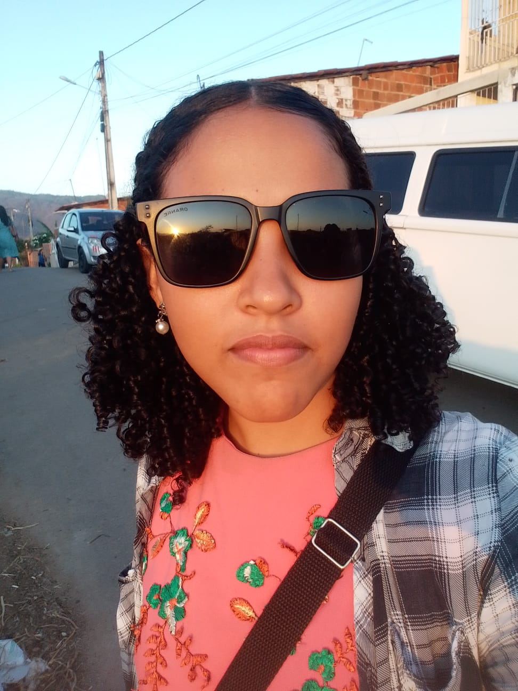
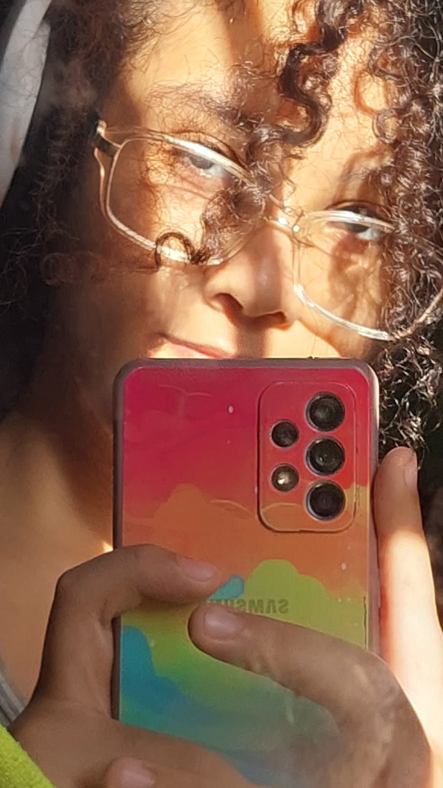
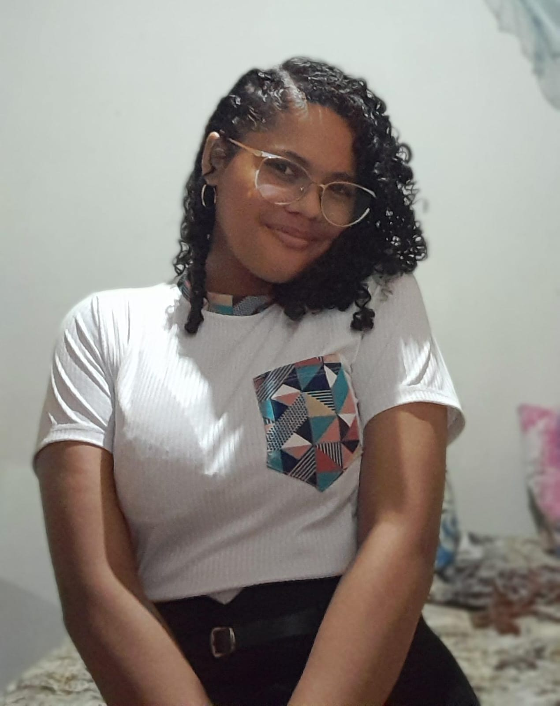
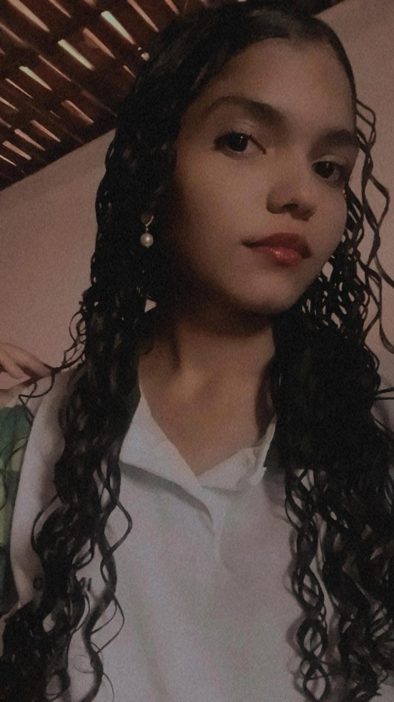

# Bem-vindo, nós somos a Survivants! 

##  Quem somos?
Uma empresa criada durante a disciplina de POO.

**Visão:** 
Desenvolver tecnologias que proporcionem uma experiência única ao usuário.

**Missão:** 
Garantir segurança e confiabilidade aos usuários.
   
**Valores:** 
Focar no que conseguimos aprender no caminho e trabalhar em equipe.

##  No que estamos trabalhando?
Atualmente estamos trabalhando no projeto Lumora desenvolvendo um App e um Jogo em Java. 
Para mais informações acesse nosso repositório: [Lumora](https://github.com/Survivantts/Lumora)

##  Entre em contato conosco:

## Participantes

🐼[Amanda](https://github.com/AmandaSimao01)

Dev - 17 anos.

🎨[Yuri/Thalita](https://github.com/YuriThali) 

Dev - 16 anos.

🎶[Renara](https://github.com/Renaras) 

Designer - 17 anos.

🦋[Yasmin](https://github.com/yasmin0liver) 

Designer - 17 anos.

